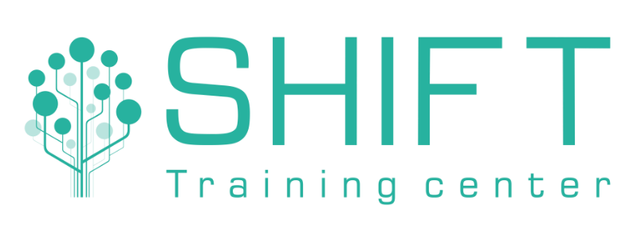

# PostgreSQL Оптимизация запросов

## Программа курса
 
Введение	

1.	Демобаза «Авиаперевозки»
2.	Выполнение запросов	
3.	Последовательный доступ	
4.	Индексный доступ	
5.	Сканирование по битовой карте	
6.	Соединение вложенным циклом	
7.	Соединение хешированием	
8.	Соединение слиянием	
9.	Статистика	
10.	Профилирование	
11.	Приемы оптимизации
 

# Учебный центр "Шифт"

Учебный центр «ШИФТ» специализируется на обучении IT специалистов, обучает мировым лидерам IT-отрасли, готовит специалистов высокого класса к реальной практической работе.

За это время было разработано более 100 специализированных курсов: для программистов, системных администраторов, системных аналитиков, разработчиков и т.д.

Кроме этого, Школа информационных и финансовых технологий подготавливает профессионалов по направлению автоматизированного проектирования, обучает офисный персонал организации, и проводит тренинги, начиная от малого бизнеса заканчивая корпорациями. 

Преподаватели учебного центра вкладывают все свои знания, умения и навыки с огромным практическим опытом в каждого слушателя.

Учебные классы полностью укомплектованы оборудованием для комфортного обучения, оснащены современной техникой и презентационным оборудованием.

[https://www.eshift.ru/o-nas/uchebnyy-tsentr-shift/](https://www.eshift.ru/o-nas/uchebnyy-tsentr-shift/)