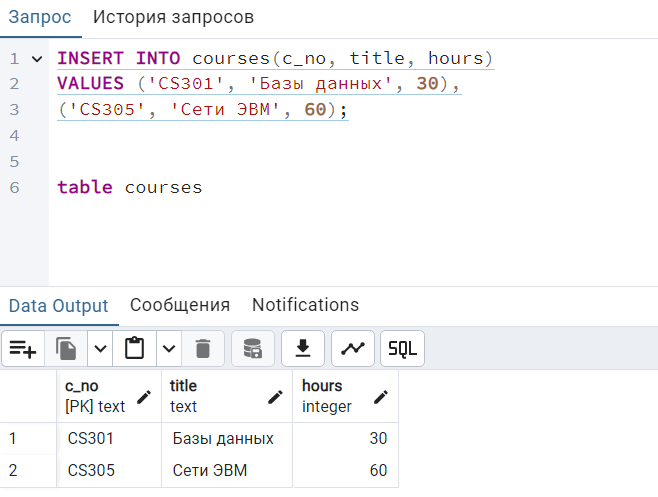

## Наполнение таблиц

Добавим в созданную таблицу несколько строк:

```sql
test=# INSERT INTO courses(c_no, title, hours)
VALUES ('CS301', 'Базы данных', 30),
('CS305', 'Сети ЭВМ', 60);
INSERT 0 2
```



Для массовой загрузки данных из внешнего источника команда INSERT подходит плохо, зато есть специально пред-
назначенная для этого команда COPY: postgrespro.ru/doc/sql-copy.

Создадим в базе еще две таблицы: «Студенты» и «Экзамены». 

Пусть по каждому студенту хранится его имя и год поступления, а идентифицироваться он будет номером студенческого билета.

```sql
test=# CREATE TABLE students(
s_id integer PRIMARY KEY,
name text,
start_year integer
);
CREATE TABLE
test=# INSERT INTO students(s_id, name, start_year)
VALUES (1451, 'Анна', 2014),
(1432, 'Виктор', 2014),
(1556, 'Нина', 2015);
INSERT 0 3
```

Таблица экзаменов содержит данные об оценках, полученных студентами по различным дисциплинам. 
Таким образом, студенты и дисциплины связаны друг с другом отношением «многие ко многим»: один студент может сдавать